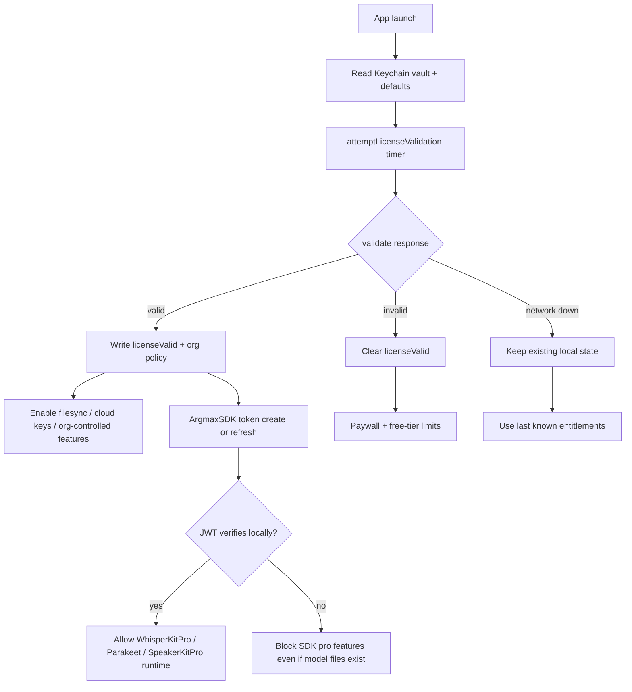

# Superwhisper Pro Gating Research Checklist

Started: 2026-05-25 19:14:57 EDT

Purpose: understand **where and how** Superwhisper gates Pro features, using inspection and observation only. This checklist is for research/documentation, not license circumvention.

Related log: [research-superwhisper.md](./research-superwhisper.md)

---

## Phase 0 — Setup

- [x] Confirm installed app: `/Applications/superwhisper.app` v2.13.2
- [x] Identify local state locations
- [x] Redact secrets in notes (UUIDs, license keys, tokens, inference keys)
- [ ] Optional: install Proxyman/mitmproxy for HTTPS observation
- [ ] Optional: prepare LLDB session for call-flow tracing

### Local state map

| Store | Path / service | What it likely controls |
|---|---|---|
| Keychain vault | `com.superwhisper.vault` | License key, validity, org policy, free-trial counters, inference API keys |
| App defaults | `~/Library/Preferences/com.superduper.superwhisper.plist` | Mirrors like `licenseValid`, cached cloud model catalog, sync timestamps |
| Argmax SDK cache | `~/Library/Application Support/com.superduper.superwhisper/argmax.*` | SDK anonymous ID, `isLicensed`, token status cache |
| App data/models | `~/Library/Application Support/superwhisper/` | Downloaded local models, SQLite history DB |
| Sentry cache | `~/Library/Caches/com.superduper.superwhisper/io.sentry` | Crash/telemetry only |

---

## Phase 1 — Baseline snapshot (before experiments)

Captured on this Mac at session start.

### App-level license flags

| Signal | Value | Notes |
|---|---|---|
| `licenseValid` (defaults) | `0` | App considers license invalid right now |
| Keychain vault item | present | Service `com.superwhisper.vault`, modified `2026-05-23` |
| `remoteCloudLanguageModels` cache | present | Cached catalog includes models tagged `"licenseType":"pro"` |

### Argmax SDK flags

| Signal | Value | Notes |
|---|---|---|
| `argmax.isLicensed` | `false` | Current SDK licensed flag |
| `argmax.licenseStatusCache.last_update.licenseEvent` | `token_creation` | Historical event only |
| `argmax.licenseStatusCache.last_update.has_pro_access` | `true` | Stale success record from prior session |
| `argmax.licenseStatusCache.last_update.status_code` | `201` | Does not imply current access |

**Important:** app license and Argmax SDK license are separate caches. Do not treat one as proof of the other.

### Local Pro model artifacts already on disk

These exist locally regardless of current license flags:

- `argmaxinc/parakeetkit-pro/nvidia_parakeet-v3_494MB`
- `argmaxinc/ctckit-pro/canary-1b-v2_474MB`
- `argmaxinc/speakerkit-pro/*`
- Root ONNX helpers: `emb-v1.onnx`, `seg-v1.onnx`, `vad-v1.onnx`

Having files on disk does **not** mean runtime will allow Pro execution.

---

## Phase 2 — Static gate map (from binary/resources)

### Core modules to trace in debugger or logs

| Module | Likely role |
|---|---|
| `LicenseManager.swift` | Activate/validate license, write vault, post `licenseActivated` |
| `CloudState.swift` | Cloud/offline entitlement state |
| `FilesyncManager.swift` / `FilesyncService` | Cross-device sync, gated on valid license |
| `ModelManager.swift` | Local/cloud model availability |
| `APIManager.swift` | HTTP client to `api.superwhisper.com` |
| `PaywallState` / `PaywallWindowController` | UI paywall surfaces |
| `ArgmaxSDK` + `LicenseJwtVerifier.swift` | SDK token create/refresh + JWT verification |

### Backend surfaces by concern

| Concern | Base / route | Auth / evidence |
|---|---|---|
| App license activate | `POST https://api.superwhisper.com/license/activate` | License key from checkout/deeplink/manual entry |
| App license validate | `POST https://api.superwhisper.com/license/validate` | Vault license key + device/install identity |
| Email verify | `POST https://api.superwhisper.com/license/email/verify` | Email verification flow |
| Cloud inference keys | `v1/inference/key`, `v2/inference/key` | Likely after valid license/org |
| Cloud model catalog | `GET https://api.superwhisper.com/models/language/cloud` | Cached in defaults as `remoteCloudLanguageModels` |
| Cross-device sync | `/users/create`, `/file/check-updates?since=`, `/file/upload`, `/file/delete`, `/file/download` | `Bearer` + `X-ID` + `X-License` + `X-Signature` |
| Usage stats | `POST /stats/recording/bulk` | Org flag `syncStatsEnabled` |
| SDK pro token | `POST https://api.argmaxinc.com/v1/license-token/create` / `refresh` | JWT verified locally |

### Validation policy (from embedded log strings)

| Condition | App behavior |
|---|---|
| Server says invalid | `License is invalid, set license invalid and return` |
| Network/API outage during validate | `do nothing - API is down` (keep current local state) |
| No valid license | `No valid license; skipping sync cycle` |
| Org disables stats sync | `Stats sync disabled in org vault data` |

---

## Phase 3 — Feature-to-gate matrix

Status key: **Confirmed** = strong static evidence; **Observed** = seen on this machine; **Inferred** = likely but not runtime-proven; **Pending** = needs experiment.

| Feature / surface | Gate layer | Local evidence | Remote evidence | Offline behavior | Status |
|---|---|---|---|---|---|
| Basic dictation / free models | App free tier | free-plan UI strings | unknown | likely works | Confirmed |
| Pro trial usage | App trial counters | `usedFreeSecondsVaultKey`, `totalFreeSeconds` | likely in validate response | trial may work until exhausted | Confirmed |
| Paywall UI | App UI | `PaywallState`, `PaywallPage`, `OnboardingPaywall` | checkout/Stripe portal URLs | can show without network | Confirmed |
| More than 2 modes | App free tier | `You can only have up to 2 modes on the free plan` | unknown | likely enforced locally | Confirmed |
| File transcription | App free tier | `You cannot transcribe files on the free plan` | unknown | likely enforced locally | Confirmed |
| Cloud language models (GPT/Claude/Gemini/etc.) | App license + catalog | `remoteCloudLanguageModels` entries with `"licenseType":"pro"` | `/models/language/cloud`, cloud completion routes | catalog fetch observed even when validate returns `License not found`; execution likely still blocked at use-time | Observed cache + Pending UI probe |
| Cloud voice models (Deepgram/ElevenLabs/Superwhisper cloud) | App license + API keys | `DeepgramWebSocketManager`, `ElevenLabsWebSocketManager`, Bearer auth strings | cloud websockets / Superwhisper AI endpoints | websockets fail without entitlement | Confirmed / Pending runtime |
| Server-issued inference keys | App license/org | `inferenceAPIKey`, `inferenceV2APIKey` in vault | `v1/inference/key`, `v2/inference/key` | stale keys may exist in vault | Confirmed |
| Local WhisperKit Pro models | Argmax SDK JWT | `WhisperKitPro is not available with your SDK license` | `/v1/license-token/*` | model files may exist but runtime blocked | Confirmed |
| Local Parakeet Pro models | Argmax SDK JWT | Parakeet/ParakeetKit Pro strings | `/v1/license-token/*` | model files present on this Mac | Confirmed / Observed |
| SpeakerKit / diarization | Argmax SDK JWT | `SpeakerKitPro is not available with your SDK license`, `Failed to initialize SpeakerKitPro` | `/v1/license-token/*` | model files present | Confirmed |
| Filesync (settings/modes/models across Macs) | App license | `_filesyncEnabled`, `FilesyncManager` | `/users/create`, `/file/*` | skipped when invalid | Confirmed |
| Stats sync | Org policy | `syncStatsEnabled`, `lastRecordingStatSync` | `/stats/recording/bulk` | skipped when disabled/invalid | Confirmed |
| Recording retention enforcement | Org policy | `recordingRetentionDuration`, org UI copy | likely validate/org payload | may still run locally | Confirmed |
| Agent / Claude hook integration | App feature set | `AgentSessionManager`, `claude-hook` helper | unknown | partially local | Confirmed module map / Pending gate |

---

## Phase 4 — Runtime observation protocol

Use this order so each step has a clean before/after diff.

### Experiment A — Launch baseline

- [x] Launch app: `open -a /Applications/superwhisper.app`
- [x] Confirm process running
- [ ] Record whether paywall/onboarding appears
- [ ] Note which models appear selectable vs greyed out

**Session result:** app launched (PID observed). `licenseValid` remained `0`. No entitlement-related lines appeared in Unified Logging during a short capture; release build likely does not emit those strings to `log show`.

### Experiment B — License validation attempt

Goal: see whether startup triggers `/license/validate`.

1. Snapshot defaults + argmax files + keychain metadata
2. Launch app online
3. Capture network to `api.superwhisper.com` for 60–120s
4. Snapshot again and diff

Watch for changes in:

- `licenseValid`
- vault modification time
- `argmax.isLicensed`
- `argmax.licenseStatusCache`

- [x] Confirmed startup network targets via CFURL cache (`~/Library/Caches/com.superduper.superwhisper/Cache.db`)
- [x] Probed unsigned API behavior with `curl`
- [ ] HTTPS proxy capture of signed request headers (needs Proxyman/mitmproxy)

**Run 1 — 2026-05-25 19:16 EDT**

| Endpoint | When | Cached/body result | Implication |
|---|---|---|---|
| `POST /license/validate` | `2026-05-25 22:58:57` | body=`License not found` | Explicit server invalidation; matches `licenseValid=0` |
| `GET /models/language/cloud` | `2026-05-25 22:58:57` | JSON catalog (~3397 bytes) | Catalog fetch can succeed even while validate says license missing |
| unsigned `GET /models/language/cloud` | curl probe | HTTP 401 `Invalid signature` | Superwhisper API expects signed requests |
| unsigned `POST /license/validate` `{}` | curl probe | HTTP 500 `Error on license validation check` | Same error text embedded in app binary |
| unsigned `POST /license/activate` `{}` | curl probe | HTTP 401 `Invalid signature` | Activation also signature-gated |
| unsigned Argmax token create | curl probe | HTTP 400 `Authentication Failed` | Separate auth stack |

Local state diff after launch: **no changes** to argmax file mtimes; `licenseValid` remained `0`.

### Experiment C — Offline fail-open behavior

Goal: test `"API is down"` behavior.

1. Snapshot current state
2. Block network for Superwhisper or go offline
3. Relaunch app
4. Observe whether previously enabled features remain available
5. Restore network and repeat snapshot

Expected from static strings: invalid **response** revokes; outage **does not** immediately revoke.

### Experiment D — Feature probe matrix

For each row below, attempt the action once and record UI message + network call + local state diff.

| Action to try | Expected block message / behavior | Endpoint to watch |
|---|---|---|
| Select a Pro cloud language model | paywall / Pro license required | `/models/language/cloud`, cloud completion route |
| Start Parakeet local realtime | SDK license error or paywall | `api.argmaxinc.com/v1/license-token/*` |
| Enable filesync in settings | disabled or no-op with invalid license | `/users/create`, `/file/check-updates` |
| Transcribe a file | free-plan block string | maybe none |
| Create 3rd custom mode | 2-mode free limit | maybe none |
| Use Deepgram/ElevenLabs cloud voice model | connection/auth failure or paywall | websocket/API endpoints |

### Experiment E — LLDB flow trace (optional)

Research-only breakpoints:

- `SecItemCopyMatching` / `SecItemAdd` with service `com.superwhisper.vault`
- URL requests containing `license/validate`, `license-token`, `inference/key`
- Swift types: `LicenseManager`, `FilesyncManager`, `PaywallState`, `ArgmaxSDK.LicenseJwtVerifier`

Goal: identify the **decision function**, not patch return values.

---

## Phase 5 — Decision tree (working model)



---

## Phase 6 — Findings template

Copy this section for each experiment run.

```markdown
### Run: YYYY-MM-DD HH:MM
- Network: online/offline
- licenseValid before/after:
- argmax.isLicensed before/after:
- vault mtime before/after:
- User action:
- UI result:
- Network calls observed:
- Local files changed:
- Conclusion:
```

---

## Current conclusions (static + baseline + Run 1)

1. Superwhisper Pro is enforced by **multiple independent gates**, not one boolean.
2. **App license** controls paywall, filesync, org policy, cloud catalog/inference keys.
3. **Argmax SDK license** separately controls local Pro model runtime (WhisperKitPro/Parakeet/SpeakerKitPro).
4. On this Mac, local Pro model files exist, but both app and SDK license flags are currently false/inconsistent.
5. Server endpoints are central; Superwhisper API calls require **request signatures** (`Invalid signature` without them).
6. At launch, the app **does call** `/license/validate`; this Mac currently gets **`License not found`**, which aligns with `licenseValid=0`.
7. `/models/language/cloud` can still return a catalog in the same launch window, so **catalog availability ≠ license validity**.
8. Unified Logging did not surface entitlement strings in release builds; **CFURL cache inspection** was the best no-proxy runtime signal.
9. Next highest-value steps: UI feature probes (Experiment D), offline relaunch (Experiment C), or HTTPS proxy to observe signed headers once.

---

## Ethical boundary

Do not use this checklist to forge headers, patch binaries, modify vault values, or replay tokens/license keys. Use it to document architecture, failure modes, and local/server boundaries.
